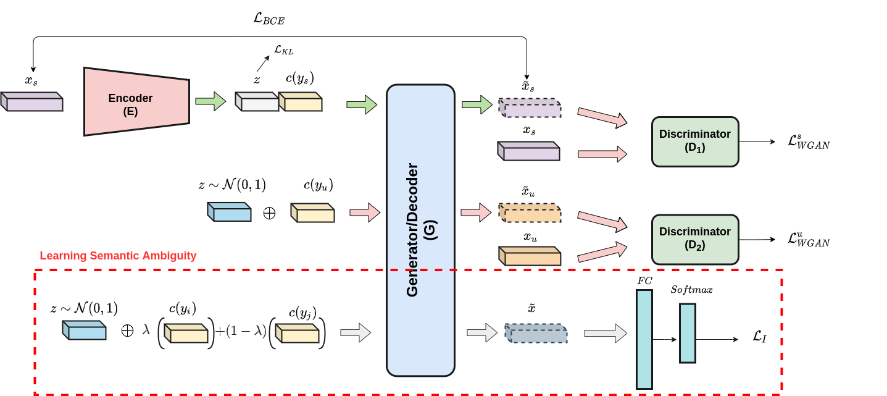

# Learning Semantic Ambiguities for Zero-Shot Learning


Authors : Celina Hanouti, Hervé Le Borgne

Papers: https://arxiv.org/abs/2201.01823

Zero-shot learning (ZSL) aims at recognizing classes for which no visual sample is available at training time. 
To address this issue, one can rely on a semantic description of each class. A typical ZSL model learns a mapping between the visual samples of seen classes and the corresponding semantic descriptions, in order to do the same on unseen classes at test time. State of the art approaches rely on generative models that synthesize visual features from the prototype of a class, such that a classifier can then be learned in a supervised manner. However, these approaches are usually biased towards seen classes whose visual instances are the only one that can be matched to a given class prototype.
We propose a regularization method that can be applied to any conditional generative-based ZSL method, by leveraging only the semantic class prototypes. It learns to synthesize discriminative features for possible semantic description that are not available at training time, that is the unseen ones. The approach is evaluated for ZSL and GZSL on four datasets commonly used in the literature, either in inductive or transductive settings, with results on-par or above state of the art approaches.

## **Overall Architecture:** 

<p align="center">
  
  <br/>
  <br/>
</p>


## Requirements
+ Python 3.6.13
+ Pytorch 1.10.0
+ scikit-learn 0.23.2
+ scipy 1.5.2
+ numpy 1.17.0
+ black==21.12

## Installation
For installing, follow these intructions
```
conda create --name lsa python=3.6.13 -y 
conda activate lsa
pip install -r requirements.txt
```

## Data preparation

### Standard ZSL and GZSL datasets

Download CUB, AWA2, FLO and SUN features from the drive link shared below.
```
link: https://drive.google.com/drive/folders/1v7pXxUEuMLrP5kObjkd3MQ5SSXZlfOD8?usp=sharing

```
Finetuned features available at : 

```
https://drive.google.com/drive/folders/13-eyljOmGwVRUzfMZIf_19HmCj1yShf1
```


Extract them in the `data` folder (with a subfolder for each dataset).

## Training

To train and evaluate ZSL and GZSL models on CUB, AWA, FLO and SUN, run:

For transductive setting : 

```
CUB : make cub_trans
AWA : make awa_trans
FLO : make flo_trans
SUN : make sun_trans
```

For inductive setting : 

```
CUB : make cub_ind
AWA : make awa_ind
FLO : make flo_ind
SUN : make sun_ind
```

## Acknowledgments

The code is mostly inspired by the implementation of the paper "Latent Embedding Feedback and Discriminative Features for Zero-Shot Classification" available at : https://github.com/akshitac8/tfvaegan.

## Citation

If you find this useful, please cite our work as follows:

```
@article{DBLP:journals/corr/abs-2201-01823,
  author    = {Celina Hanouti and
               Herv{\'{e}} Le Borgne},
  title     = {Learning Semantic Ambiguities for Zero-Shot Learning},
  journal   = {CoRR},
  volume    = {abs/2201.01823},
  year      = {2022},
  url       = {https://arxiv.org/abs/2201.01823},
  eprinttype = {arXiv},
  eprint    = {2201.01823},
  timestamp = {Mon, 10 Jan 2022 13:39:01 +0100},
  biburl    = {https://dblp.org/rec/journals/corr/abs-2201-01823.bib},
  bibsource = {dblp computer science bibliography, https://dblp.org}
}
```
